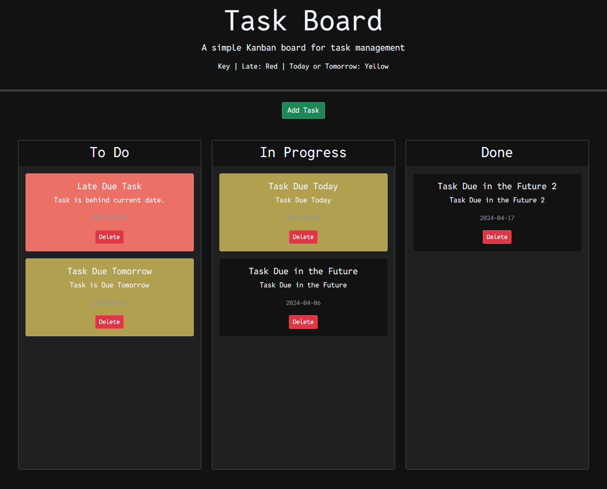

# Workflow Tracker

## Description

• This is a simple Kanban board utilized to track the workflow of myself and other participating people within designated tasks and objectives. There are three swim lanes that are labeled: "To Do, In Progress, and Done." Each tracks task cards with there respective Title, Description and Due Date that has been assigned to them from a modal that appears on screen when the "Add Task" button is pressed. There has been color coding applied to any card that is late, due today or due tomorrow. These dates are calculated using dayJS within the existing script and index pages. IF the card is late, then its applied with a red color style. Any card that is due today or tomorrow is colored with a yellow style. All others remain in their default styling upon creation. When a card is moved between lanes the color remains until it is placed in the done coloumn. However, if the cards are moved back, the color is re-applied. In the future I would like to add the ability to have the color coding update with the dates as well. This is something that I will look into in a future project. This way if something is due tomorrow and placed into done, but has to be reworked and is moved back into in progress it can turn red if its now past its due date. This would apply for future cards, today, tomorrow, etc..

## Link to Deployed Application.

• [https://jtoton.github.io/Workflow-Tracker/]

## Table of Contents:

- [Installation](#installation)
- [Usage](#usage)
- [Credits](#credits)
- [License](#license)
- [Mockup](#Mockup)
- [Badges](#Badges)
- [Features](#Features)
- [Contributions](#Contributions)
- [Tests](#Tests)
- [Citations](#Citations)
- [NewCitations](#NewCitations)

## Installation

• There are no installation steps required. The project is housed within a GitHub repository that has an index.html file within it. All assets and files are included within the folders and sub-folders located on the repo.
If one wanted to pull the repo to examine the project in detail then cloning the repository would be the only step required. Otherwise the link is live and can be accessed here on GitHub.

## Usage

• Create card tasks to track the workflow of ones our projects or team projects.

• Modal that opens upon request in order to enter details for task cards: Title, Description and Due Date.

• Interactive movement and color coding.

• Card management through movable dragging and deletion.

## Credits

• All credit for the materials, files and code are giving to the bootcamp instructors and the information provided within the course material.

• Information and details can be found here: [https://bootcampspot.instructure.com/courses/5301/assignments/74767?module_item_id=1209851].

• Additionally, the base project was cloned from this repository (README and Instructions). [https://git.bootcampcontent.com/University-of-Utah/UofU-VIRT-FSF-PT-02-2024-U-LOLC].

• Other examples or assistance was located from: [https://www.w3schools.com/html/html5_semantic_elements.asp].

• Any and all other information gathered was located via links provided in the previously cited school links which housed other resources and links to view and learn from.

## License

• This project has a standard MIT license. Source: https://choosealicense.com/licenses/mit/

• This license seemed appropriate given that it will be accessed, cloned and assessed by any and all who may be performing a review, assessment or grading of the project and my work herewithin.

## Badges

## Mockup

## Features

• index.html file that houses the code for the project and links together all assets used within it.

• script.js to control state changes within a modal menu, card creation and details, swim lane functions and task card functions.

• style.css files to control the look and style of the features within.

• style.css to control all task card styling

• Responsive Design: The website is built with responsiveness in mind, ensuring that it looks great and functions seamlessly across various devices and screen sizes.

• Interactive Elements: Engage with the content using interactive elements with draggable features.

## Contributions

• Contribuation are not welcome and or accepted.

• This project is a graded assignment that will reflect my progress within the first 1 to 2 weeks of class.

• However, it will be accessed, cloned and accessed by any and all who may be performing a review, assessment or grading of the project and my work herewithin.

• That being said, any of the aforementioned representatives of the school or private company that are responsible for accessing, grading or reviewing the project have expressed permission to edit, add notes, add comments or perform any work necessary to complete this task.

## Tests

• Testing has not been included within this project as of yet. I look forward to learning more about this process, given my QA experience, and adding it to the project in the future.

## Citations

• Agile Alliance. (2023, October 18). Agile Manifesto for Software Development | Agile Alliance. Agile Alliance |. https://www.agilealliance.org/agile101/the-agile-manifesto/

• CSS Property: list-style-type | HTML Dog. (n.d.). https://www.htmldog.com/references/css/properties/list-style-type/

• GitHub: Let’s build from here. (n.d.). GitHub. https://github.com/

• OpenAI. (2023). ChatGPT (Mar 14 version) [Large Language model]. (n.d.). ChatGPT (Mar 14 Version) [Large Language Model]. https://chat.openai.com/chat

-NOTE: ChatGPT was only used to assist in creating dialog for the README file. The OpenAI software was not used to assist in any code generation, HTML edits, CSS edits or
otherwise any of the assets located within the repository other than this README specifically. The software was used to assist in creating a professional README.md file that
would meet standards within the industry (to the best of my knowledge). Additionally, school resources, linked within the citations already, were used in combination to flush
out the design.

• GitLab. (n.d.). https://git.bootcampcontent.com/University-of-Utah/UofU-VIRT-FSF-PT-02-2024-U-LOLC

• What makes up a web development project? (n.d.). The Full-Stack Blog. https://coding-boot-camp.github.io/full-stack/web-development/web-dev-project

• All other links, sources and information gained and used within the project were found or otherwise located within the above sources(sublinks within the above links). The
classwork, modules, TA's, as well as the instructor provided a multitude of links within the assignment itself as well as within class demonstrations and our communication
through slack and or discord.

• All previous resources were additionally used within this project. However more resources were used within as I attempted to create more advanced sections within the . js .css and index file for my first porfolio attempt.

• Curriculum | University of Utah Professional Education Coding Boot Camp. (2024, March 6). University of Utah Professional Education Boot Camps. https://bootcamps.continue.utah.edu/coding/curriculum/

• Function return values - Learn web development | MDN. (2024, January 1). MDN Web Docs. https://developer.mozilla.org/en-US/docs/Learn/JavaScript/Building_blocks/Return_values

• How to create a prompt for an array in JavaScript. (n.d.). https://www.shecodes.io/athena/45475-how-to-create-a-prompt-for-an-array-in-javascript#google_vignette

• JavaScript Array reference. (n.d.). https://www.w3schools.com/jsref/jsref_obj_array.asp

• JavaScript Array sort() Method. (n.d.). https://www.w3schools.com/jsref/jsref_sort.asp

• JavaScript arrays. (n.d.). https://www.w3schools.com/js/js_arrays.asp

• JavaScript string Methods. (n.d.). https://www.w3schools.com/js/js_string_methods.asp

• JavaScript String slice() Method. (n.d.). https://www.w3schools.com/jsref/jsref_slice_string.asp#:~:text=The%20slice()%20method%20extracts,second%20is%201%2C%20.
• Pierce, D. (2022, November 28).

• How to resolve an uncaught reference error in Javascript | Rollbar. Rollbar. https://rollbar.com/blog/javascript-referenceerror/#:~:text=Reference%20errors%20in%20Javascript%20are%20mainly%20thrown%20when%20an%20attempt,called%20in%20the%20correct%20scope.

• return - JavaScript | MDN. (2023, August 11). MDN Web Docs. https://developer.mozilla.org/en-US/docs/Web/JavaScript/Reference/Statements/return

• GfG. (2023, December 7). Check if a variable is a string using JavaScript. GeeksforGeeks. https://www.geeksforgeeks.org/check-if-a-variable-is-a-string-using-javascript/

• ISNAN() - JavaScript | MDN. (2023, December 29). MDN Web Docs. https://developer.mozilla.org/en-US/docs/Web/JavaScript/Reference/Global_Objects/isNaN

• return - JavaScript | MDN. (2023, August 11). MDN Web Docs. https://developer.mozilla.org/en-US/docs/Web/JavaScript/Reference/Statements/return

• while - JavaScript | MDN. (2023, September 10). MDN Web Docs. https://developer.mozilla.org/en-US/docs/Web/JavaScript/Reference/Statements/while

• Better Comments - Visual Studio marketplace. (n.d.). https://marketplace.visualstudio.com/items?itemName=aaron-bond.better-comments

• Contributors, M. O. J. T. a. B. (n.d.). Cards. https://getbootstrap.com/docs/5.1/components/card/

• BACK Arrow Emoji (U+1F519). (n.d.). https://www.iemoji.com/view/emoji/773/symbols/back-arrow

• HTML button tag. (n.d.). https://www.w3schools.com/tags/tag_button.asp

• Austin. (2021, June 11). How to build HTML forms right: Semantics. Austin Gil. https://austingil.com/how-to-build-html-forms-right-semantics/

• Emoji buttons html. (n.d.). Stack Overflow. https://stackoverflow.com/questions/40577709/emoji-buttons-html

• HTML footer Tag. (n.d.). https://www.w3schools.com/tags/tag_footer.asp

• Window localStorage property. (n.d.). https://www.w3schools.com/jsref/prop_win_localstorage.asp

• HTML forms. (n.d.). https://www.w3schools.com/html/html_forms.asp

• JavaScript HTML input examples. (n.d.). https://www.w3schools.com/js/js_input_examples.asp

## NewCitations

• Day.js · 2kB JavaScript date utility library. (n.d.). https://day.js.org/en/

• OpenJS Foundation - openjsf.org. (n.d.). JQuery UI. https://jqueryui.com/

• Contributors, M. O. J. T. a. B. (n.d.). Bootstrap. https://getbootstrap.com/
